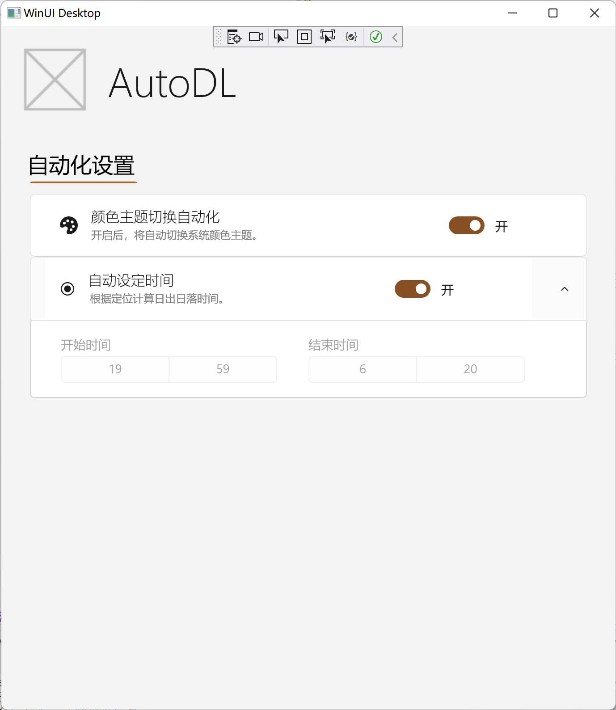

# AutoDL

简体中文   ||   [English](README.en-US.md)

🎨本实用程序提供面向Windows 10/11的颜色主题管理程序。

## 特性

- 读取并管理Windows颜色主题偏好设置（注册表）。

- 定时切换Windows颜色主题。

- 计算日出、日落时间并切换Windows颜色主题。

## 关于

本项目灵感来源：[DarkMode](https://github.com/Melon-Studio/DarkMode)。

本项目使用[LGPL](LICENSE.md)协议，敬请各位严格遵守协议，欢迎对本仓库做出你力所能及的贡献😘！

